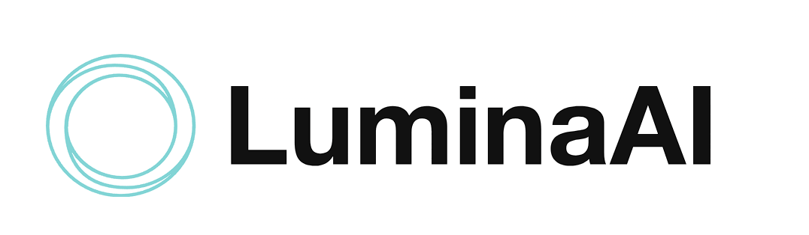

# Lumina AI
Lumina AI is a local, privacy-focused AI assistant designed specifically for healthcare professionals. It leverages a Retrieval-Augmented Generation (RAG) model powered by LLaMA (Large Language Model Meta AI) to provide intelligent, context-aware responses and insights based on user-submitted documents. Additionally, Lumina AI includes a database AI agent that analyzes, summarizes, and connects documents, making it an invaluable tool for doctors, physicians, therapists, and other healthcare professionals.

<video controls src="LuminaAI Test.mp4" title="Title"></video>

# Features
- Runs completely local - Lumina AI runs entirely on your local machine, ensuring data privacy and security for sensitive healthcare information.
- Database AI Agent - Analyzes and connects documents, summarizes content, and provides actionable insights.
- Requires No Internet - No internet connection is needed due to the local functionality
- Can access the following document types - .pptx .pdf .txt .csv .docx .mp4 .avi .mov
- Document Summarization - Automatically generates concise summaries of lengthy documents, saving time.
- Knowledge Integration - Insights from the database AI agent are fed back into the system, optimizing the RAG model's knowledge base.
- Simple User-Interface - Provides a simple user interface for easy usage.

# Libraries
- Created using Langchain - ollama - Chroma
- Check requirements.txt for full library usage

# Support
For questions or feedback - Contact raypoulton11@yahoo.com

# Acknowledgments
Meta AI LLaMa llm model
